# My Book Collection

I love reading books
because every page I turn is a step closer to a better version of myself.

 

Here is a list of books that I've read
so far, and many more are waiting for me in my reading list

[reading list](https://docs.google.com/spreadsheets/d/1gmrEc9gaaHpKJeFolC2IxEj6Oj-5aKEZAE0MTIZAo5c/edit?usp=sharing)

[goodreads profile](https://www.goodreads.com/user/show/199576984-amanpreet-singh)

<table>
  <tr>
    <td align="center" width="25%">
      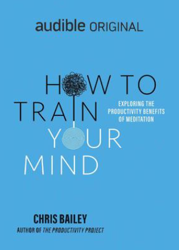 
      <b>How To Train Your Mind</b> 
      Chris Bailey
    </td>
    <td align="center" width="25%">
      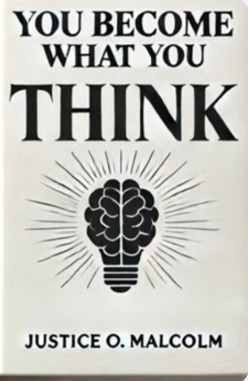 
      <b>You Become What You Think</b> 
      Justice O Malcolm
    </td>
    <td align="center" width="25%">
      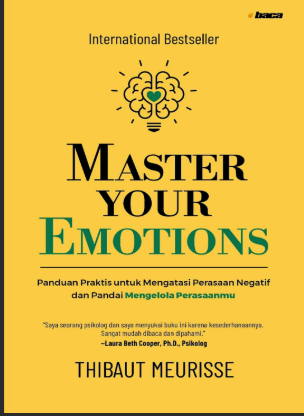 
      <b>Master Your Emotions</b> 
      Thibaut Meurisse
    </td>
    <td align="center" width="25%">
      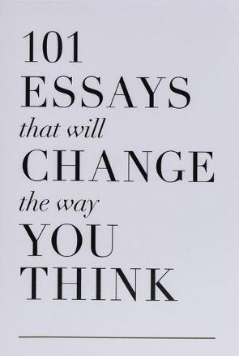 
      <b>101 Essays</b> 
      DiAnn Gilbertson
    </td>
  </tr>
  <tr>
    <td align="center" width="25%">
       
      <b>The Monk Who Sold His Ferrari</b> 
      Robin Sharma
    </td>
    <td align="center" width="25%">
      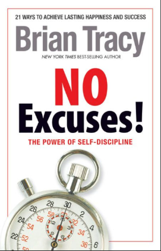 
      <b>No Excuses!</b> 
      Brian Tracy
    </td>
    <td align="center" width="25%">
      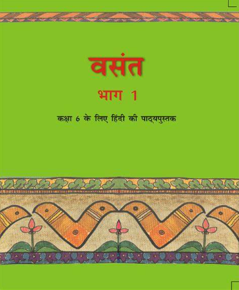 
      <b>Vasant</b> 
      Class 6 Hindi NCERT
    </td>
    <td align="center" width="25%">
       
      <b>The Power Of Self-Confidence</b> 
      Brian Tracy
    </td>
  </tr>
  <tr>
    <td align="center" width="25%">
      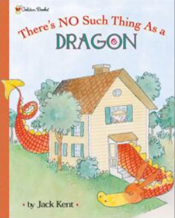 
      <b>There's No Such Thing As A Dragon</b> 
      Jack Kent
    </td>
    <td align="center" width="25%">
      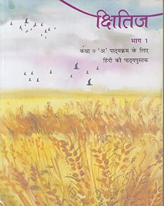 
      <b>Shitij</b> 
      Class 9 Hindi NCERT
    </td>
    <td align="center" width="25%">
      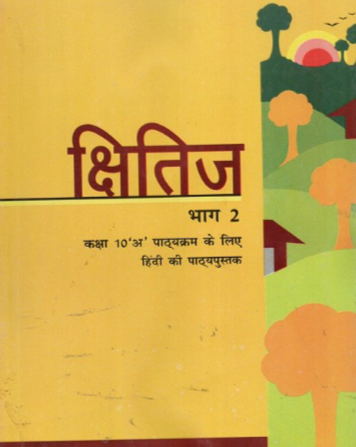 
      <b>Shitij</b> 
      Class 10 Hindi NCERT
    </td>
    <td align="center" width="25%">
      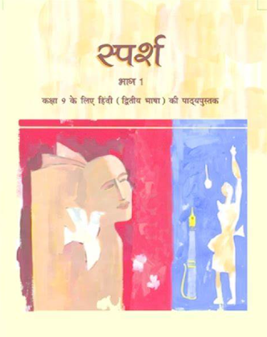 
      <b>Sparsh</b> 
      Class 9 Hindi NCERT
    </td>
  </tr>
  <tr>
    <td align="center" width="25%">
       
      <b>The Earth Our Habitat</b> 
      Class 6 Geography NCERT
    </td>
    <td align="center" width="25%">
       
      <b>The Power Of Strangers</b> 
      Joe Keohane
    </td>
    <td align="center" width="25%">
      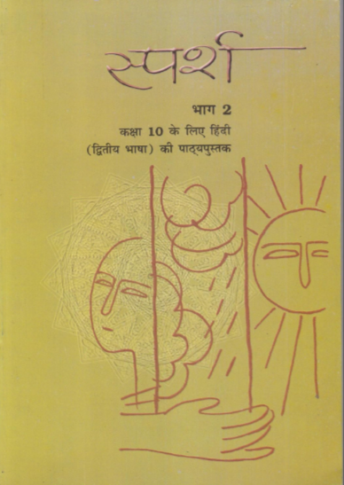 
      <b>Sparsh</b> 
      Class 10 Hindi NCERT
    </td>
    <td align="center" width="25%">
       
      <b>Vistas</b> 
      Class 12 English NCERT
    </td>
  </tr>
  <tr>
    <td align="center" width="25%">
      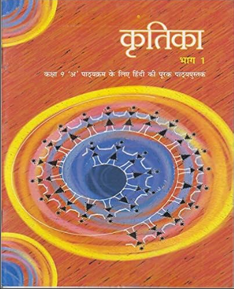 
      <b>Krithika</b> 
      Class 9 Hindi NCERT
    </td>
    <td align="center" width="25%">
      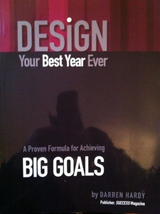 
      <b>Design Your Best Year Ever</b> 
      Darren Hardy
    </td>
    <td align="center" width="25%">
      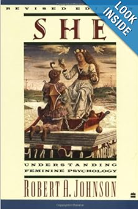 
      <b>She</b> 
      Robert A. Johnson
    </td>
    <td align="center" width="25%">
      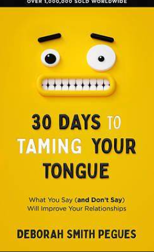 
      <b>30 Days To Taming Your Tongue</b> 
      Deborah Smith Pegues
    </td>
  </tr>
  <tr>
    <td align="center" width="25%">
      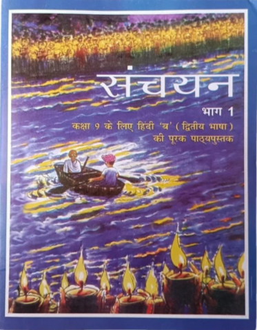 
      <b>Sanchayan</b> 
      Class 9 Hindi NCERT
    </td>
    <td align="center" width="25%">
       
      <b>He</b> 
      Robert A. Johnson
    </td>
    <td align="center" width="25%">
       
      <b>A Walk To Remember</b> 
      Nicholas Sparks
    </td>
    <td align="center" width="25%">
       
      <b>Voices From S-21</b> 
      David Chandler
    </td>
  </tr>
  <tr>
    <td align="center" width="25%">
      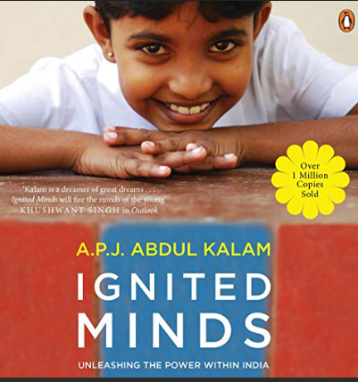 
      <b>Ignited Minds</b> 
      APJ Abdul Kalam
    </td>
    <td align="center" width="25%">
      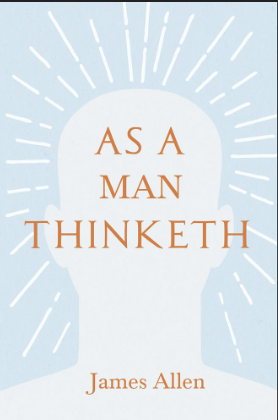 
      <b>As A Man Thinketh</b> 
      James Allen
    </td>
    <td align="center" width="25%">
      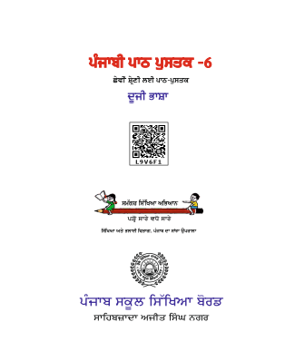 
      <b>Duzi Basha</b> 
      Class 6 Punjabi PSEB
    </td>
    <td align="center" width="25%">
      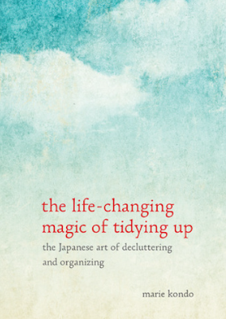 
      <b>The Life Changing Magic Of Tidying Up</b> 
      Marie Kondo
    </td>
  </tr>
  <tr>
    <td align="center" width="25%">
      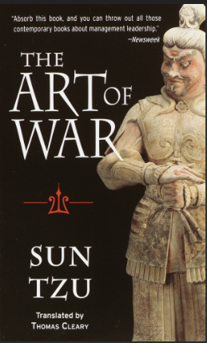 
      <b>The Art Of War</b> 
      Sun Tzu
    </td>
    <td align="center" width="25%">
      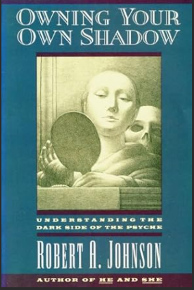 
      <b>Owning Your Own Shadow</b> 
      Robert A. Johnson
    </td>
    <td align="center" width="25%">
      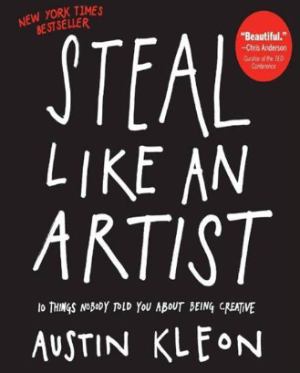 
      <b>Steal Like An Artist</b> 
      Austin Kleon
    </td>
    <td align="center" width="25%">
       
      <b>Dream Big</b> 
      Cristiane Correa
    </td>
  </tr>
  <tr>
    <td align="center" width="25%">
       
      <b>Permanent Record</b> 
      Edward Snowden
    </td>
    <td align="center" width="25%">
       
      <b>Families Without Fathers</b> 
      David Popenoe
    </td>
    <td align="center" width="25%">
      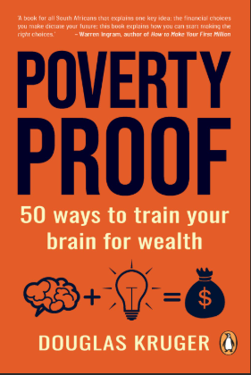 
      <b>Poverty Proof</b> 
      Douglas Kruger
    </td>
    <td align="center" width="25%">
      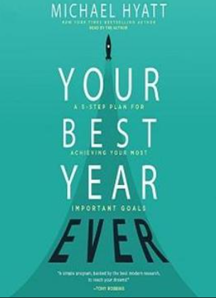 
      <b>Your Best Year Ever</b> 
      Michael Hyatt
    </td>
  </tr>
  <tr>
    <td align="center" width="25%">
      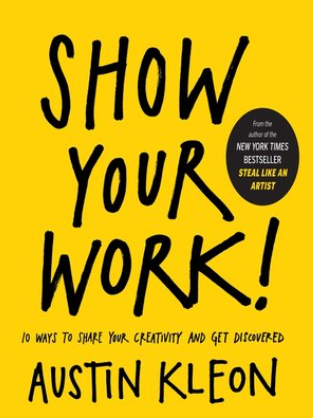 
      <b>Show Your Work</b> 
      Austin Kleon
    </td>
    <td align="center" width="25%">
      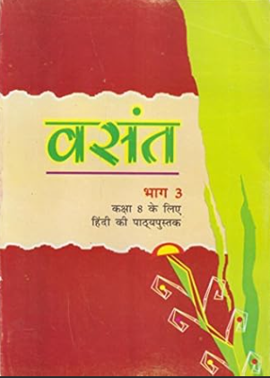 
      <b>Vasant</b> 
      Class 8 Hindi NCERT
    </td>
    <td align="center" width="25%">
       
      <b>One Million Digits Of Pi</b> 
      Socrates Co
    </td>
    <td align="center" width="25%">
      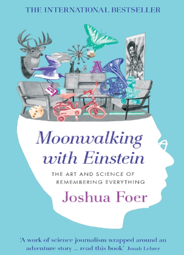 
      <b>Moonwalking With Einstein</b> 
      Joshua Foer
    </td>
  </tr>
  <tr>
    <td align="center" width="25%">
      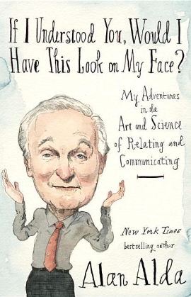 
      <b>If I Understood You, Would I Have This Look On My Face?</b> 
      Alan Alda
    </td>
    <td align="center" width="25%">
       
      <b>Beyond Order</b> 
      Jordan B. Peterson
    </td>
    <td align="center" width="25%">
      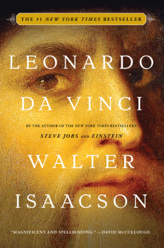 
      <b>Leonardo Da Vinci</b> 
      Walter Isacson
    </td>
    <td align="center" width="25%">
      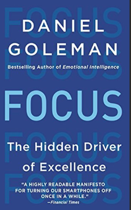 
      <b>Focus</b> 
      Daniel Goleman, Heidi Grant
    </td>
  </tr>
  <tr>
    <td align="center" width="25%">
      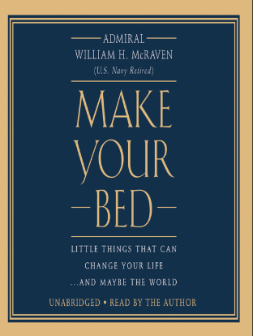 
      <b>Make Your Bed</b> 
      Admiral William H. McRaven
    </td>
    <td align="center" width="25%">
      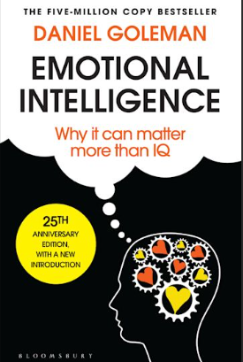 
      <b>Emotional Intelligence</b> 
      Daniel Goleman
    </td>
    <td align="center" width="25%">
      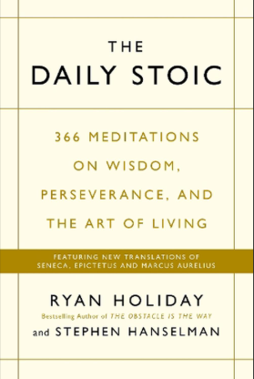 
      <b>The Daily Stoic</b> 
      Ryan Holiday
    </td>
    <td align="center" width="25%">
       
      <b>Your Brain On Porn</b> 
      Gary Wilson
    </td>
  </tr>
  <tr>
    <td align="center" width="25%">
       
      <b>Ikigai</b> 
      Hector Garcia
    </td>
    <td align="center" width="25%">
      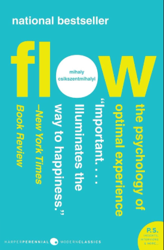 
      <b>Flow</b> 
      Mihaly Csikszentmihalyi
    </td>
    <td align="center" width="25%">
      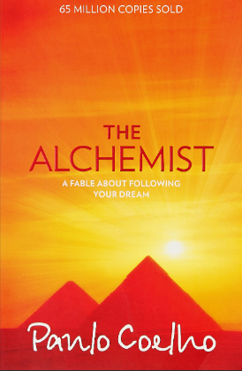 
      <b>The Alchemist</b> 
      Paulo Coelho
    </td>
    <td align="center" width="25%">
      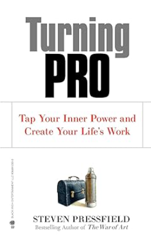 
      <b>Turning Pro</b> 
      Steven Pressfield
    </td>
  </tr>
  <tr>
    <td align="center" width="25%">
       
      <b>Change Your Words, Change Your World</b> 
      Andrea Gardner
    </td>
    <td align="center" width="25%">
       
      <b>Captivate</b> 
      Vanessa Van Edwards
    </td>
    <td align="center" width="25%">
      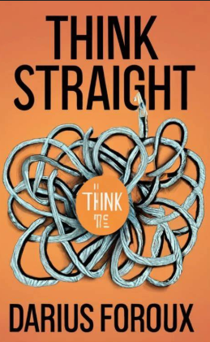 
      <b>Think Straight</b> 
      Darius Foroux
    </td>
    <td align="center" width="25%">
      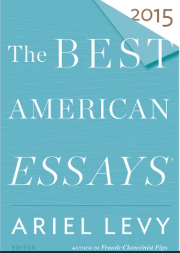 
      <b>The Best American Essays 2015</b> 
      Ariel Levy, Robert Atwan
    </td>
  </tr>
  <tr>
    <td align="center" width="25%">
       
      <b>This Book Loves You</b> 
      PewDiePie
    </td>
    <td align="center" width="25%">
       
      <b>The Way Of Men</b> 
      Jack Donovan
    </td>
    <td align="center" width="25%">
       
      <b>Train To Pakistan</b> 
      Khuswant Singh
    </td>
    <td align="center" width="25%">
       
      <b>The Walking Dead</b> 
      Robert Kirkman
    </td>
  </tr>
  <tr>
    <td align="center" width="25%">
       
      <b>The Intelligent Investor 100 Page Summary</b> 
      Preston Pysh
    </td>
    <td align="center" width="25%">
      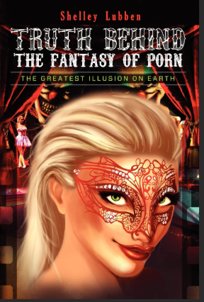 
      <b>Truth Behind The Fantasy Of Porn</b> 
      Shelley Lubben
    </td>
    <td align="center" width="25%">
      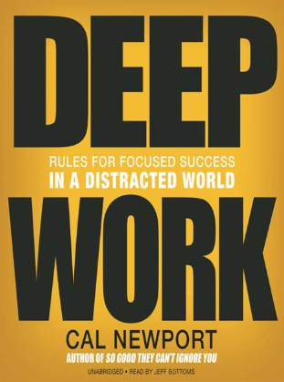 
      <b>Deep Work</b> 
      Cal Newport
    </td>
    <td align="center" width="25%">
      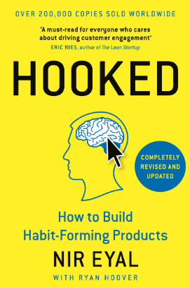 
      <b>Hooked</b> 
      Nir Eyal
    </td>
  </tr>
  <tr>
    <td align="center" width="25%">
      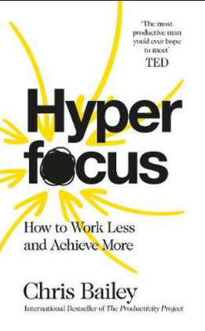 
      <b>Hyperfocus</b> 
      Chris Bailey
    </td>
    <td align="center" width="25%">
       
      <b>Can't Hurt Me</b> 
      David Goggins
    </td>
    <td align="center" width="25%">
      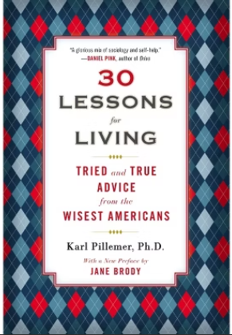 
      <b>30 Lessons For Living</b> 
      Karl Phillemer
    </td>
    <td align="center" width="25%">
       
      <b>Words Can Change Your Brain</b> 
      Andrew Newberg
    </td>
  </tr>
  <tr>
    <td align="center" width="25%">
       
      <b>The Choice</b> 
      Edith Eger
    </td>
    <td align="center" width="25%">
      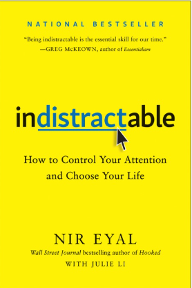 
      <b>Indistractable</b> 
      Nir Eyal
    </td>
    <td align="center" width="25%">
      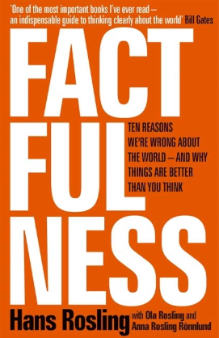 
      <b>Factfullness</b> 
      Hans Roasting
    </td>
    <td align="center" width="25%">
       
      <b>Think & Grow Rich</b> 
      Napoleon Hill
    </td>
  </tr>
  <tr>
    <td align="center" width="25%">
       
      <b>The 10 Pillars Of Wealth</b> 
      Alex Becker
    </td>
    <td align="center" width="25%">
      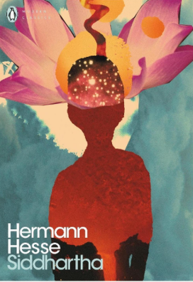 
      <b>Siddartha</b> 
      Hermann Hesse
    </td>
    <td align="center" width="25%">
      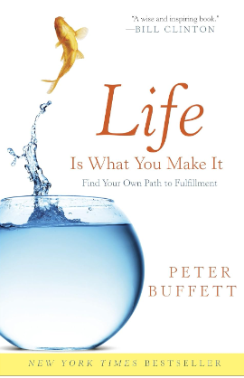 
      <b>Life Is What You Make It</b> 
      Peter Buffett
    </td>
    <td align="center" width="25%">
      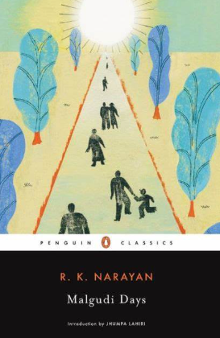 
      <b>Malgudi Days</b> 
      RK Narayan
    </td>
  </tr>
  <tr>
    <td align="center" width="25%">
       
      <b>Sam Walton</b> 
      Sam Walton
    </td>
    <td align="center" width="25%">
      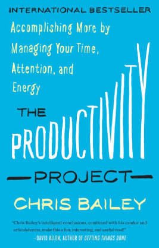 
      <b>The Productivity Project</b> 
      Chris Bailey
    </td>
    <td align="center" width="25%">
       
      <b>Rich Dad Poor Dad</b> 
      Robert T Kiyosaki
    </td>
    <td align="center" width="25%">
       
      <b>The Goal</b> 
      Eliyahu M Goldratt, Jeff Cox
    </td>
  </tr>
  <tr>
    <td align="center" width="25%">
       
      <b>12 Rules For Life</b> 
      Jordan B. Peterson
    </td>
    <td align="center" width="25%">
       
      <b>Mindset</b> 
      Carol Dweck
    </td>
    <td align="center" width="25%">
       
      <b>Why Read?</b> 
      Mark Edmundson
    </td>
    <td align="center" width="25%">
       
      <b>The Happiness Hypothesis</b> 
      Jonathan Haidt
    </td>
  </tr>
  <tr>
    <td align="center" width="25%">
       
      <b>Man's Search For Meaning</b> 
      Victor E. Frankl
    </td>
    <td align="center" width="25%">
       
      <b>Thus Spoke Zarathustra</b> 
      Friedrich Nietzsche
    </td>
    <td align="center" width="25%">
       
      <b>Ordinary Men</b> 
      Christopher R Browning
    </td>
    <td align="center" width="25%">
       
      <b>What Every Body Is Saying</b> 
      Joe Navarrow
    </td>
  </tr>
  <tr>
    <td align="center" width="25%">
       
      <b>Atomic Habits</b> 
      James Clear
    </td>
    <td align="center" width="25%">
       
      <b>Why We Sleep</b> 
      Matthew Walker
    </td>
    <td align="center" width="25%">
       
      <b>The Diary Of A Young Girl</b> 
      Anne Frank
    </td>
    <td align="center" width="25%">
       
      <b>Manhood In The Making</b> 
      David D. Gilmore
    </td>
  </tr>
  <tr>
    <td align="center" width="25%">
       
      <b>Leaders</b> 
      Stanley McChrystal
    </td>
    <td align="center" width="25%">
       
      <b>The Compound Effect</b> 
      Darren Hardy
    </td>
    <td align="center" width="25%">
       
      <b>Getting To Yes</b> 
      Roger Fisher
    </td>
    <td align="center" width="25%">
       
      <b>Animal Farm</b> 
      Geroge Orwell
    </td>
  </tr>
  <tr>
    <td align="center" width="25%">
       
      <b>The Subtle Art Of Not Giving A F*ck</b> 
      Mark Manson
    </td>
    <td align="center" width="25%">
       
      <b>Maus</b> 
      Art Spiegelman
    </td>
    <td align="center" width="25%">
       
      <b>The Richest Man In Babylon</b> 
      George Clason
    </td>
    <td align="center" width="25%">
       
      <b>The Brothers Karamazov</b> 
      Fyodor Dostoevsky
    </td>
  </tr>
  <tr>
    <td align="center" width="25%">
       
      <b>No More Mr. Nice Guy</b> 
      Dr Robert Glover
    </td>
    <td align="center" width="25%">
       
      <b>What To Say When You Talk To Yourself</b> 
      Shad Helmstetter
    </td>
    <td align="center" width="25%">
       
      <b>The 80/20 Principle</b> 
      Richard Koch
    </td>
    <td align="center" width="25%">
       
      <b>Gratitude Works</b> 
      Robert A. Emmons
    </td>
  </tr>
  <tr>
    <td align="center" width="25%">
       
      <b>The Star Of The Zoo</b> 
      Virginie Zurcher, Daniel Howarth
    </td>
    <td align="center" width="25%">
       
      <b>Rainbowsaurus</b> 
      Steve Antony
    </td>
    <td align="center" width="25%">
       
      <b>The Wheels On The Bus</b> 
      Donovan Bixley
    </td>
    <td align="center" width="25%">
       
      <b>Japan 1945</b> 
      Joe O'Donnell
    </td>
  </tr>
  <tr>
    <td align="center" width="25%">
       
      <b>Public Speaking For Success</b> 
      Dale Carnegie
    </td>
    <td align="center" width="25%">
       
      <b>Managing Oneself</b> 
      Peter F Drucker
    </td>
    <td align="center" width="25%">
       
      <b>Rhapsody And Prism</b> 
      ICSE Class 12
    </td>
    <td align="center" width="25%">
       
      <b>Stop Reading The News</b> 
      Rolf Dobelli
    </td>
  </tr>
  <tr>
    <td align="center" width="25%">
       
      <b>Where Is The Bermuda Triangle</b> 
      Megan Stine
    </td>
    <td align="center" width="25%">
       
      <b>A Pact With The Sun</b> 
      NCERT Class 6 English
    </td>
    <td align="center" width="25%">
       
      <b>HoneySuckle</b> 
      NCERT Class 6 English
    </td>
    <td align="center" width="25%">
       
      <b>Rikki-Tikki-Tavi</b> 
      Rudyard Kipling
    </td>
  </tr>
  <tr>
    <td align="center" width="25%">
       
      <b>Your Brain on ChatGPT</b> 
      Research Paper Published by Scientists from MIT
    </td>
    <td align="center" width="25%">
       
      <b>ನಮ್ಮ ಮನೆ</b> 
      Rukmini Banerji
    </td>
    <td align="center" width="25%">
       
      <b>Durva</b> 
      Class 6 NCERT Hindi Textbook
    </td>
    <td align="center" width="25%">
       
      <b>Alien Hand</b> 
      Class 7 NCERT English Textbook
    </td>
  </tr>
  <tr>
    <td align="center" width="25%">
       
      <b>Learning About NO</b> 
      T Chakou Albert
    </td>
    <td align="center" width="25%">
       
      <b>Treasury of Pleasure Books for Young Children</b> 
      Joseph Cundall
    </td>
    <td align="center" width="25%">
       
      <b>The Royal Toothache ਰਾਜੇ ਜੀ ਦੰਦ ਸਾਫ ਕਰ</b> 
      Sanjiv Jaiswal
    </td>
    <td align="center" width="25%">
       
      <b>Liite Sock and the Tiny Creatures ਜੁਰਾਬ ਗਵਾਚ ਗਈ</b> 
      Jon Keevy
    </td>
  </tr>
  <tr>
    <td align="center" width="25%">
       
      <b>Are You With Me?</b> 
      Kouri Richins
    </td>
    <td align="center" width="25%">
       
      <b>Stolen Focus</b> 
      Johann Hari
    </td>
    <td></td>
    <td></td>
  </tr>
</table>
